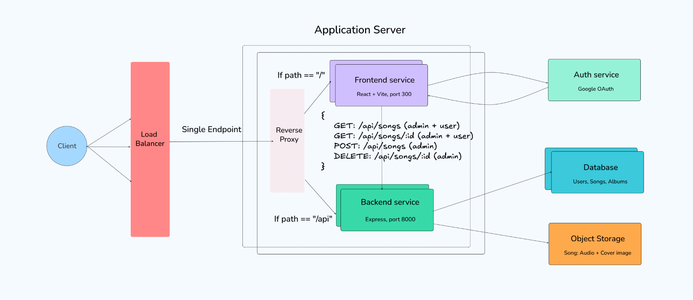
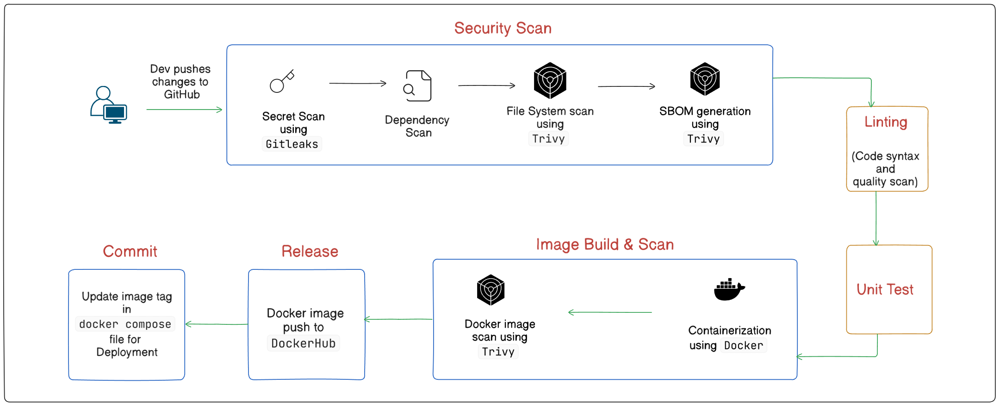

This project is forked from [burakorkmez/realtime-spotify-clone](https://github.com/burakorkmez/realtime-spotify-clone) to learn and showcase my skills on containerization of application, implementation of CI/CD pipeline for automatic security scanning, testing, and building and finally deploying via docker compose. I have also performed **migration** of <u>third-party services used like Clerk, Cloudinary, MongoDB</u> to <u>AWS-native solutions - AWS Cognito, S3, and DocumentDB</u>👍

<br>



```
                                                --------------
                                                |  Internet  |
                                                --------------   
                                                      |
                                                   AWS ALB
                                                      |
                                           Target Group (Port 80)
                                                      |
                                                 EC2 Instance
                                      -----------------------------------
                                                      |
                                              Traefik (Port 80)
                                            ┌──────────┴──────────┐
                                            │                     │
                                      PathPrefix("/")     PathPrefix("/api")
                                            │                     │
                                         Frontend              Backend

```

## 📋 <a name="table">Table of Contents</a>

1. [Tech Stack](#tech-stack)
2. [Quick Start](#quick-start)
3. [Devopsification of the project](#devops)

## <a name="tech-stack">Tech Stack</a>
<p>1. Frontend - Typescript, React, Tailwind, Zustand, Vite</p>
<p>2. Backend - Node, Express</p>
<p>3. AWS - Cognito (Auth), S3 (Object storage), DocumentDB (Database)</p>
<p>4. Traefik as reverse proxy (if using Docker)

## <a name="quick-start">Quick Start (via Docker Compose)</a>

**Prerequisites**: Git, Docker

**Cloning the Repository**

```bash
git clone https://github.com/harshitrajsinha/spotify-clone-devops.git
cd spotify-clone-devops
```

**Set Up Environment Variables**

#### Setup .env file in _backend_ folder

```env
PORT=8000
MONGODB_URI=<mongodb cloud>
ADMIN_EMAIL=
NODE_ENV=development

AWS_REGION=
S3_BUCKET_NAME=

# AWS_ACCESS_KEY_ID
# AWS_SECRET_ACCESS_KEY

FRONTEND_URL=http://localhost # (Traefik reverse proxy endpoint)

COGNITO_DOMAIN=
COGNITO_CLIENT_ID=
COGNITO_CLIENT_SECRET=
COGNITO_REDIRECT_URI=
COGNITO_USER_POOL_ID=
```

#### Setup .env file in _frontend_ folder

```env
VITE_BACKEND_URL=http://localhost # (Traefik reverse proxy endpoint)
VITE_MODE=development
VITE_COGNITO_DOMAIN=
VITE_COGNITO_CLIENT_ID=
```
* Update frontend/nginx.conf
```bash
# Make sure nginx.conf contains backend url as
#location /api/ {
#    proxy_pass http://localhost;    <----- Traefik entrypoint
#    ...
#}
```

**Building and Running the Project**
```
docker compose up --build
```

NOTE: Data is loaded into database manually because adding this script into Dockerfile or Compose poses the risk of writing data into database everytime container restarts. This is problem in production, especially with large amount of data

# <a name="devops">Devopsifying the project</a>

### 🐳 Dockerizing frontend and backend application

The backend and frontend services have been successfully containerized using a multi-stage Docker build approach, with `node:24.16.0-alpine3.23` and `nginx:stable-alpine3.23` as the respective final-stage base images. As a result, the final application images are only 16% (backend) and 4% (frontend) larger than their minimal runtime base images, by following Docker image optimization best practices

 

#### Learnings:

1. Secured frontend Docker image build-time environment variables using Build Secrets.<br/><br/>
2. Improved the build time by combining copying and changing file ownership into single command (this could have significant impact depending on number of application files)
<br/><br/>
<hr>

### 🔄 Continuous Integration

A successful CI pipeline is built that runs when code changes are pushed for frontend and backend on dev (development) and main (production) branch. Depending on the environment development/production, different tasks are performed under the following jobs - 1. Security Scan, 2. Linting, 3. Test, 4. Image build and scan, 5. Release to DockerHub, 6. Commit new image tag to docker-compose file

 


#### Learnings:
1. How different tools are used to scan and secure the project, and choosing the right tool for development or production based on its impact on pipeline duration and performance.
2. How to include a human approval step using the environment argument to ensure that the code being deployed to production is the expected version.

<hr>

### 🏗️ Terraform (Infrastructure as Code)

The application infrastructure consists of total of 84 terraform resources that are created from 12 different AWS services that facilitates the flow of request between client, DevOps engineer and application server, along with other AWS resources that integrates with the application like database, object storage etc. A list of which could be found in the following link - 
[https://raw.githubusercontent.com/harshitrajsinha/spotify-clone-devops/refs/heads/main/terraform/app-infra-resources.json](https://raw.githubusercontent.com/harshitrajsinha/spotify-clone-devops/refs/heads/main/terraform/app-infra-resources.json)

Terraform CI pipeline: CI pipeline for terraform ensures that any new commit on terraform resources code must go through security check, syntax check, vulnerability scan before being merged.

ode commit? → Secrets scan → Format check (terraform fmt) → Validation check (terraform validate) → Linting (using TFLint) → Vulnerability scan (using Trivy)

<hr>

## AWS-native architecture


## Migration from Clerk to AWS Cognito
* Integrated Google OAuth in AWS Cognito (same as it was available previously through Clerk), hence there is no change on User facing interface.
* On code level - majority of the authentication workload, in case of Clerk, that was handled by frontend is now shifted onto backend where frontend verifies the user and shares a code with backend, which then generate authentication cookie and save it on client's browser.
<br/>


